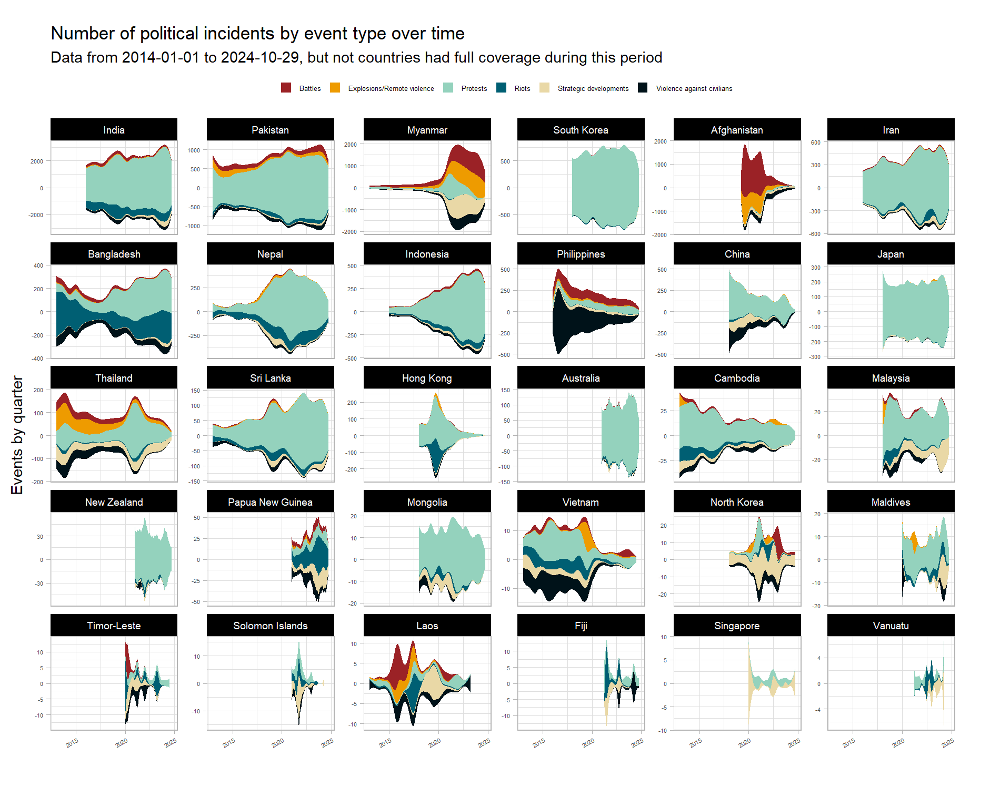
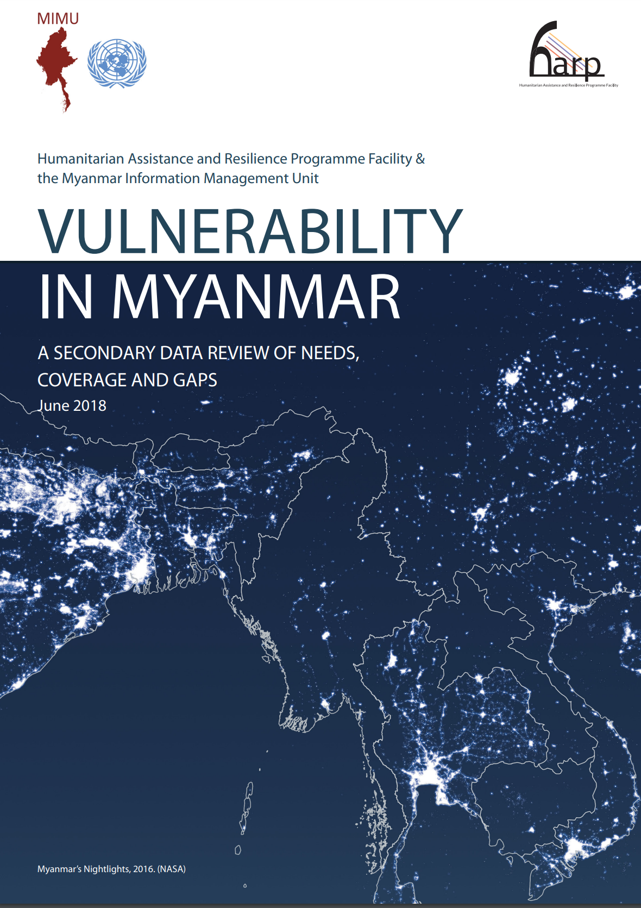
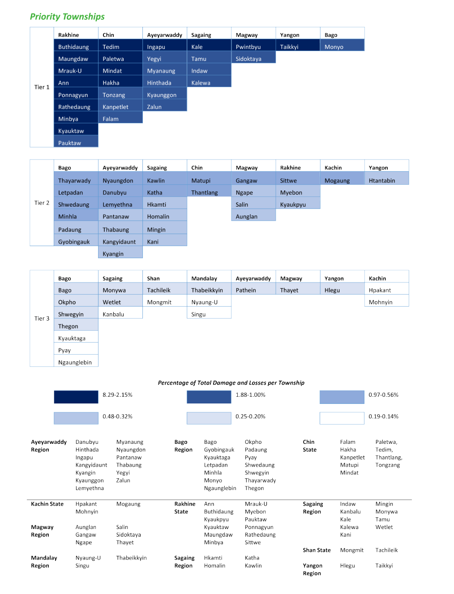

&nbsp;&nbsp;&nbsp;&nbsp;&nbsp;&nbsp;&nbsp;&nbsp;[contact](mailto:sean@aimdata.org)
&nbsp;&nbsp;&nbsp;&nbsp;&nbsp;&nbsp;&nbsp;&nbsp;&nbsp;&nbsp;&nbsp;&nbsp;&nbsp;[github](https://github.com/aimdata-labs)

### **Make the most of your data**

 

Data cleaning and visualisation. Strategy and actionable data. Reporting systems and data quality.  

Sri Lanka, China, Japan, Thailand, Philippines, Nepal, Myanmar, Bangladesh, El Salvador, Venezuela, Syria and Kenya.

Data analyst and disaster management expert. Armed conflict, complex emergencies and natural hazards. 

This site showcases some of our projects. Other code and projects may also be found here: [Myanmar repositories](https://github.com/orgs/food-security-cluster-myanmar/repositories), [Syria repositories](https://github.com/orgs/northwest-syria-cash-working-group/repositories)
and [Kenya repositories](https://github.com/orgs/kenya-eie-wg/repositories)

   

### [Lebanon Conflict Brief](https://seanywng.github.io/conflict_trends_public/lebanon)
25 September 2024. 

   

### [Asia-Pacific Conflict Trends](https://seanywng.github.io/conflict_trends_public/)
30 August 2024. 

   

### [Myanmar Township Prioritisation](https://food-security-cluster-myanmar.github.io/mmr_township_prioritisation/)
1 June 2022. 

   

### [Understanding Conflict Dynamics in Myanmar through Conflict and Incident Data: A Food Security Perspective](https://food-security-cluster-myanmar.github.io/exploratory-data-analysis-acled-fsc/)
Updated 1 June 2022. 

{width=30%}

   

### [Report on the 2022/Q1 Food Security 5Ws](https://food-security-cluster-myanmar.github.io/fsc_5ws_first_quarter_2022/)
[PDF version](https://www.dropbox.com/s/ibswwmfhjpp9odh/fsc_2022_q1_5ws_report.pdf?dl=0)

{width=50%}

   

### [Multi-sector Beneficiary Allocations and Cash-based Interventions in the Syria Cross-Border Response](https://northwest-syria-cash-working-group.github.io/multisector_4Ws_review/#1) 
19 May 2023

   

### [Coverage and Gaps Analysis -- Education, Health, Nutrition, Protection and WASH Clusters, Venezuela](https://seanywng.github.io/coverage_gaps_venezuela/)

   

### [5W Cleaning Script](https://seanywng.github.io/5W/cleaning_5ws_english) and [Reporting Script](https://seanywng.github.io/5W/reporting_5ws_english) -- Education Cluster, Venezuela

     

### And some links to past work (only PDFs available): 

### [A New Index of Refugee Protection 2018 -- a discussion note with Aldo Benini](http://aldo-benini.org/Level2/HumanitData/Benini_Ng__A_New_Protection_Index__180806.pdf)

   

### [Lessons Learnt on Assessments from the Rohingya Refugee Response 2018](https://www.dropbox.com/s/z859umvx6kmikm5/Lessons Learnt on Assessments 180525_SN.pdf?dl=0)

   

### [Vulnerability in Myanmar 2017 -- Secondary Data Review, Countrywide](https://themimu.info/sites/themimu.info/files/documents/Report_Vulnerability_in_Myanmar_HARP-MIMU_Jun2018_ENG_Print_version.pdf)

   

### [Myanmar National Recovery Framework and Plan -- Floods and Landslides 2015](https://www.dropbox.com/s/iv975x39hzz9cye/National Recovery Framework Final-2.pdf?dl=0)

